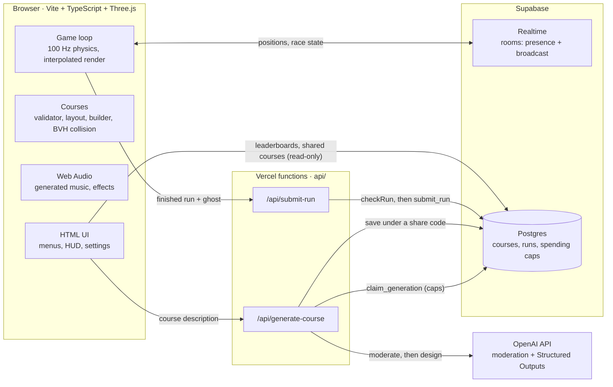

# Surf Duel

**Browser multiplayer surf racing.** Slide along steep ramps, build speed by air-strafing, and race your friends live, on hand-made courses or on courses the OpenAI API designs from a sentence you type. Inspired by the "surf" game mode from Source-engine games.

> **Play:** _link added when deployed_ · Best on a computer with a mouse and keyboard (phones get a view-only mode).

> **Uses the OpenAI API.** The AI course designer sends the description a player types to the OpenAI API: a free moderation check first, then a course designed with Structured Outputs (`gpt-5.4-nano`). See [AI course generator](#ai-course-generator) for how prompts are checked and how spending is capped.

## How to play

On a ramp to your **right**, hold **D**. On a ramp to your **left**, hold **A**. Steer with the mouse and never press **W**: your speed comes from the slope. The ramp's colour tells you which key to hold. The **Tutorial** has an on-screen coach that teaches it in about two minutes.

| Key | Action |
|---|---|
| Mouse | Look and steer |
| A / D | Hold toward the ramp you're surfing (air-strafe in the air) |
| Space | Jump (hold to bunny-hop) |
| R | Back to the last checkpoint |
| Shift + R | Restart the run |
| Esc | Pause / release the mouse |
| ↑ / ↓, Enter | Pick a course / race (start screen) |

## Features

- **Five hand-made courses** across five themes, from the coached Tutorial to Event Horizon, each with your personal-best ghost and a rival ghost to race.
- **AI course designer.** Describe a course ("long sweeping ramps over lava, one huge drop") and the OpenAI API designs it in a few seconds. Every course is repaired until it's beatable, gets a flyover preview and a 6-character share code.
- **Live multiplayer rooms** for up to 8 players (Supabase Realtime): share a link, ready up, race with live positions and standings, spectate.
- **Global leaderboards** on every course with a share code: top 10, your place, and **race anyone's ghost**. Runs are checked on the server against the course and the physics.
- **Generated soundtrack.** Every course has its own synthwave loop that builds as you speed up, or play your own music file; equalizers and the course pulse with the beat.
- **Polish:** settings (sensitivity, FOV, volumes, graphics), assist mode for trackpads, speed effects, accessibility (colour-blind-safe splits, reduced motion), and a view-only mode for phones.

## Quick start

```bash
npm install
cp .env.example .env.local   # then fill in the values below
npm run dev                  # http://localhost:5173
```

The game runs without any keys: multiplayer and leaderboards hide themselves without Supabase, and the AI designer offers a random course without OpenAI.

| Variable | Used by | What it's for |
|---|---|---|
| `VITE_SUPABASE_URL` | browser + server | Supabase project URL |
| `VITE_SUPABASE_ANON_KEY` | browser | Supabase publishable key (safe to expose) |
| `OPENAI_API_KEY` | server only | AI course design and the moderation check |
| `OPENAI_MODEL` | server only | `gpt-5.4-nano` (the spending caps are sized for its prices) |
| `SUPABASE_SERVICE_ROLE_KEY` | server only | spending caps, saving AI courses, posting leaderboard runs |

Server-only variables never reach the browser: Vite only exposes `VITE_`-prefixed ones. `npm run dev` also serves the `api/` functions through a small dev-server middleware, so the whole game works locally without the Vercel CLI.

**Database:** create a Supabase project and run the SQL files in `supabase/migrations/` in order (SQL editor, or `supabase db push`).

| Script | What it does |
|---|---|
| `npm run dev` | Dev server with the tuning panel |
| `npm test` | Unit tests (Vitest): physics, courses, playability, server handlers, run checks, audio math |
| `npm run typecheck` | Strict TypeScript, client and server |
| `npm run build` | Typecheck + production build to `dist/` |
| `npm run check:api` | Loads each `api/` function under plain Node ESM, the way Vercel runs them |

## Deploy (Vercel)

1. Import the repository in Vercel. It detects Vite: build `npm run build`, output `dist`, functions from `api/`.
2. Add the five environment variables above (Project → Settings → Environment Variables).
3. Apply `supabase/migrations/` to the Supabase project.
4. Before deploying changes to `api/` or `server/`, run `npm run check:api`: Vercel compiles each file on its own, so every relative import must name its `.js` file.

## Architecture



- **Client** (`src/`): `physics/` is pure and unit-tested (Source-style movement, capsule vs. BVH collision); `course/` turns a JSON spec into geometry, triggers and a riding line, and a bot rides every course in the tests; `game/` runs the fixed-timestep loop, races, ghosts and records; `net/` holds rooms and API clients; `render/`, `audio/` and `ui/` draw, play and show it.
- **Server** (`api/` + `server/`): thin Vercel functions over handlers that take their dependencies, so every path (rate limits, budget caps, moderation, run checks) is unit-tested without a network.
- **Database** (`supabase/migrations/`): row-level security everywhere. The browser can read courses and leaderboard columns; only the server (service role) writes, through functions that check limits in one locked step.

**Tech:** TypeScript (strict), Vite, Three.js + three-mesh-bvh, Supabase (Realtime, Postgres), Vercel functions, OpenAI API (`openai` SDK), zod, Vitest.

## How it works

### Tutorial coach

The **Tutorial** course has an on-screen coach (`src/game/tutorialCoach.ts`), paced for someone who has never surfed. A card above the speedometer has three parts that change at different speeds:

- **The lesson** (with "Step 3 of 6"): about one per ramp. It only changes at a calm moment (you've settled on a new ramp with the right key) and never before you've had time to read it (3.5–6.5 s, by length). Each lesson previews the next ramp ("The next ramp is on your left: switch to A when you fly off"), so you read what's coming before you need it. Steps: the basics (hold the key toward the ramp, never W) → walk off the pad (let go of W and hold D once you're falling) → you're surfing (look along the ramp) → ramp colours tell you the key → curves, the booster and the last ramp → finished.
- **The live hint**, one short line about your keys right now: "✓ Holding D", "! Let go of W", "! Wrong key", "→ Switch to A", and on the pad "! Walk off with W first" (A/D on the ground walks you sideways off the pad). Tapping keys never changes the lesson.
- **Notes** for a few seconds after a checkpoint (what R and Shift+R do), the first booster, or a fall (and after a fall the lesson re-teaches the ramp you're back on, straight away).

Next to it, a live W A S D / Space display: keys to hold pulse blue, keys to let go of turn orange while held.

Tests check the pacing (every lesson stays up long enough to read, in a bot run through the real Tutorial) and the advice itself: a simulated beginner who presses exactly the keys the coach shows, and nothing else, finishes the Tutorial without falling off.

### Racing

Pick a course and press **Play**: a 3-2-1 countdown (you can look around but not move), then the clock runs from GO in exact 10 ms simulation ticks. The HUD shows the run time, checkpoints reached, a progress bar with markers for each ghost, split pop-ups (`+0.42` / `−0.31` against your personal best, in colour-blind-safe blue/orange) and your speed. After the finish you get the results: time, splits, top speed, rank among your local runs, and the rival ghost's time. **R**/Enter races again, **M** goes back to the menu, **Shift+R** restarts mid-run.

Ghosts are recorded at 20 Hz and stored compactly (constant-velocity prediction + zigzag varints, ~5 KB a minute). You race your personal best (gold, **PB**) and a rival (mint):

- **DEV** — a human-recorded dev ghost from `src/course/ghosts/<course-id>.json`, or
- **BOT** — if there isn't one (or it was recorded on an older layout of the course), the cautious bot rides the course live and becomes the rival, so a solo player always has someone to race.

Records and ghosts are keyed by a fingerprint of the course spec, the layout version and the default physics (`courseKey.ts`), so a change to the course invalidates them instead of replaying ghosts through moved walls. Runs with autopilot, noclip or modified physics aren't saved.

**Recording a dev ghost:** in `npm run dev`, finish a clean run and click **Save as dev ghost** on the results screen. The dev server writes the file into `src/course/ghosts/`; commit it.

### AI course generator

**Design a course with AI** on the start screen (or **✨ AI course / code…** in a room, for the host) takes a description up to 200 characters, with five example prompts to start from. The OpenAI API designs the course; the game builds it, shows a flyover preview, and gives it a 6-character share code (`/?course=K7M2QX`) so friends can race it. **Regenerate** asks again with the same prompt; the share-code box (or a pasted link) loads anyone's course.

How it works:

- `POST /api/generate-course` (`api/generate-course.ts` → `server/generateCourse.ts`) checks the prompt (≤ 200 chars), then claims a slot from the database before spending anything, then calls OpenAI with a hard 15 s timeout.
- **Malicious prompts.** Prompts are saved with shared courses and shown to other players, and they go to an AI, so they pass several layers:
  1. `preparePrompt` (`src/course/aiSchema.ts`, run in the browser for instant feedback and again on the server): invisible and disguised text is stripped (zero-width and direction-override characters, hidden "tag" characters, look-alike letters, stacked accents), characters a description never needs (angle brackets, braces, square brackets, backticks, backslashes) are dropped, and links, emails, @handles and blocked words (`src/util/text.ts`, which sees through leetspeak, spacing and repeated letters) are turned away before anything is spent.
  2. OpenAI's **moderation check** (`server/openaiModerator.ts`; free, so it doesn't touch the prepaid credit) screens the prompt before the course model sees it. Hate, harassment, sexual, self-harm, graphic-violence and illicit descriptions are refused; plain cartoon action ("shoot zombies") is allowed. If the check can't run, the server refuses (fails closed).
  3. The prompt reaches the model as a single JSON string, labelled as a description and never instructions, and Structured Outputs forces the reply into the course schema, so the worst an injected instruction can do is shape a course. Every number is then clamped by `validateCourse`.
  4. The reply's one free-text field, the course name, is cleaned, link/word-checked by the validator (for every course from anywhere, shared or in a room) and moderated too; anything flagged becomes "Untitled Course".
  5. All of it is rendered with `textContent`, never as HTML, and saved prompts are cleaned again before they're shown.
- **Spending caps.** The game runs on a small prepaid OpenAI credit, so it can never spend more than that. One Postgres function (`claim_generation`, in `supabase/migrations/`) checks every limit and counts the generation in a single locked step, so simultaneous requests can't slip past a cap: 6 per player per 10 minutes and 40 a day (IPs stored only as a keyed hash), **150 a day across all players**, and **1,800 in total**. Each reply is capped at 1,500 tokens, so with `gpt-5.4-nano` the worst case for all 1,800 is about $4.30. Failed attempts count too. If the database can't be reached, the server refuses to call OpenAI at all.
- The call (`server/openaiDesigner.ts`) uses the Responses API with **Structured Outputs**: a strict JSON schema (`src/course/aiSchema.ts`) built from the same `LIMITS` as the zod schema, plus a system prompt that explains segment types, safe ranges, difficulty styles and theme moods, and says the player's text (sent as a JSON string) is a description, never instructions. The model comes from `OPENAI_MODEL`; prompts aren't stored on OpenAI's side (`store: false`).
- Whatever comes back goes through `validateCourse`, the same repair pass every course gets, so it is always beatable. The playability tests include deliberately extreme AI-style specs (every drop at max, max gaps, every ramp bending the same way, 40 segments) and the bot must finish each one from the start and from every checkpoint.
- The course is saved in the `courses` table under a fresh code. Anyone can read courses (RLS: select for anon); only the service role in the API can write. If saving fails you still get to race it, just without a code.
- **Never a dead end:** a timeout, an AI failure, the rate limit, a bad code or no network all show a friendly message with **Race a random course instead**.
- In a room, AI and shared courses travel as their full spec (plus share code), random ones as their seed, and every client rebuilds the same geometry.

### Leaderboards

Every shipped course and every AI/shared course (anything with a share code) has an online top 10. Random courses don't.

- **Start screen:** the selected course's top 5 sit under the course list. Pick one to race that player's ghost (pick it again to drop it); the Race button shows who you're up against.
- **Results screen:** your run on the left, the top 10 on the right with your row marked, and where your time landed ("You're #3 of 12"). **Race** on any row starts a race against that ghost straight away. Times are posted under your name (the one you use in rooms, `Surfer 123` until you change it); **Change name** re-posts your run under the new one.
- One entry per player per course: your best. The browser keeps a random player id for this (not secret, never shown).
- Runs that don't go up: autopilot/noclip, changed physics tuning, a missed checkpoint, or a room race where the tab was hidden (its clock ran on without the simulation). The run is always kept locally either way.

How it works:

- Reading is client-side: the `runs` table (`supabase/migrations/20261006090000_runs.sql`) is readable by anyone, but only the leaderboard columns, never the player id or IP hash. Nobody can write to it except the service role.
- Posting goes through `POST /api/submit-run` (`server/submitRun.ts`). The server never trusts the client's idea of the course: it loads the spec itself (shipped id, or share code from the database), builds it, and works out the course key. Then the run must pass `checkRun` (`src/course/runCheck.ts`):
  - splits: one per checkpoint, all there, increasing, before the finish;
  - time at least the course minimum (straight lines through every gate at the fastest speed the physics allows);
  - the ghost (the 20 Hz recording) lasts as long as the time claimed, starts on the start pad, never moves faster than the physics allows (velocity is clamped per axis), only teleports back to checkpoints it has already reached (R or a fall), goes through each gate when its split says, and ends at the finish.
  The tests ride real bot runs through it (including a respawn) and catch forged ones: sped-up recordings, jumps, teleports ahead, wrong splits, short or misplaced ghosts. Ghosts are public, so anything odd that slips through is visible too.
- Names get the same cleaning as every other name other players see (`cleanName`: no hidden text, links or blocked words; 16 characters).
- One Postgres function (`submit_run`) applies the rate limits (30 posts per IP per 10 minutes, 20,000 a day in total) and keeps the player's best, in one locked step. Courses get a fresh leaderboard by themselves when their geometry changes, because the course key includes the layout version.

### Multiplayer

**Create room** gives you a 4-letter code and an invite link (`/?room=ABCD`); **Join** takes a code. Up to 8 players. The host (whoever has been in the room longest) picks the course and starts the race; everyone else readies up. Testing alone? The lobby's **Open a second tab** button opens the invite in a new tab — each tab is a separate player — and **Race the dev ghost** practises the room's course solo.

How it works (`src/net/`), on Supabase Realtime, one channel per room:

- **Presence** carries each player's name, colour, status and result. The host's presence also carries the room state (course, race id, start time), so late joiners get it instantly and it survives the host leaving — the next-longest member is promoted and re-publishes it. Join order is stamped so it never depends on whose clock is wrong.
- **Broadcast** carries movement sampled at 20 Hz (position, velocity, yaw), stamped with race time. Remote players are replayed ~100 ms+ in the past with velocity-aware (Hermite) interpolation, extrapolating briefly if packets are late, snapping across respawns.
- **Synchronised start:** the host announces GO in its own clock; everyone converts it with an NTP-style offset estimated from ping/pong. Measured: both players hit GO within the same millisecond.
- **Message budget:** Realtime counts every delivered copy, so a room costs ~players² messages per send. Samples are always taken at 20 Hz but batched to fit `DEFAULT_BUDGET` (300 msg/s): one sample per message for 2 players, larger batches as the room grows. The Supabase client is lazy-loaded, so solo players never download it.
- **Edge cases:** host leaves → next player promoted; joining mid-race → spectate (chase cam, ←/→ to switch); room full (8) and invalid / unknown codes get clear messages; losing the mouse or hiding the tab doesn't pause a shared race, and time the tab spent asleep is charged to your clock; connection loss shows a reconnecting banner.

### Sound and music

Everything is made live with the Web Audio API: no sound files, nothing to license, no extra dependencies (`src/audio/`).

- **Generated soundtrack.** Every course gets its own 8-bar synthwave loop (`music.ts`), composed from its theme's mood and its course key, so the same course always sounds the same. Neon is classic synthwave, lava drives at 128 BPM in a Phrygian key, ice floats in Lydian, desert sways in harmonic minor, void broods half-time in Dorian. It builds with your speed (`levels.ts`): pads on the start pad, then bass and kick, the arpeggio, hats and snare, with a low-pass filter opening up as you go faster.
- **Your own music.** Settings → Music → My music plays an audio file you pick. It's played straight from your disk and never uploaded; pick it again on your next visit.
- **Effects:** countdown beeps and a GO chord, a checkpoint chime and finish fanfare in the song's key, a boost whoosh, a respawn sweep, and wind that rises with speed.
- **Equalizers.** An analyser on the music drives bars along the bottom of the start screen and under the speedometer, and ramp lines, grids, gates and boosters pulse with the bass (with your own music too).
- Audio starts on your first click or key press (browsers require one) and pauses in background tabs.

### Settings

⚙ Settings on the start screen (or Settings in the pause menu): mouse sensitivity, field of view, invert Y, assist mode, music and effects volume, music source (generated, your file, off), graphics quality, and the key list. Saved in localStorage.

- **Assist mode**, for trackpads and first runs: while surfing it holds the key toward the ramp for you and ignores W/S; in the air you steer 30% more strongly. The speed cap is unchanged. Runs set with it go on the same leaderboards with an **A** badge. A test proves it: a rider who only steers and never presses A or D falls off Easy Cruise without assist and finishes with it.
- **Graphics: Low** renders fewer pixels and drops the speed lines and particle bursts.

### Game feel

The view widens up to 10° with speed and leans about 1.4° toward the strafe key; speed lines rush past above 2200 u/s; checkpoints burst into particles. View effects are off when the system asks for reduced motion (`src/game/feel.ts` holds the tested numbers).

### Phones and tablets

Touch-only devices get the start screen in view-only mode: course flyovers, leaderboards and the AI course designer all work, racing (which needs a mouse) is disabled with a note, and room invites explain they need a computer.

### Course flyover

The start screen and the AI course preview fly a camera over the course (`src/render/flyover.ts`). It follows a smoothed copy of the riding line rather than the line itself: heights take a running maximum and then a wide blur, so the camera stays up until a drop is behind it and then glides down (and never dips below the line before a drop), and the zigzag between left and right ramp faces is ironed out. The cut from the finish back to the start fades through dark. Tests fly every shipped course and random ones at 60 fps and bound the glide angle, acceleration, turn rate and pitch rate.

### Courses

A course is a small JSON spec (`src/course/schema.ts`): a name, a theme (`neon`, `desert`, `ice`, `lava`, `void`), a difficulty, and a list of segments — `ramp` (length, angle 46–60°, side, curve), `drop`, `gap`, `booster`, `checkpoint`. (The original spec allowed 70° ramps; playtesting found anything past 60° barely holdable.)

Checkpoints are fly-through arches over the flight into the next ramp. Respawning at one (R, or falling off) puts you on that ramp's face already moving at the speed a cautious rider would have there, so every checkpoint is a fair restart.

- `validator.ts` repairs anything (bad numbers, unknown types, two drops in a row, gaps too long for the speed riders will have, courses too long/short or looping back on themselves) and never throws.
- `layout.ts` walks a track cursor along the *riding line* and sizes every transition from a speed model with a cautious and a fast rider: the cautious one must clear the next ramp's ridge, the fast one must still land on it (ramps are lengthened and kept straight through the landing zone). A checkpoint gate is added after every three ramps without one.
- `builder.ts` turns the layout into merged geometry (a handful of draw calls), trigger volumes and a track path (progress, kill floor).
- `playability.test.ts` runs a bot through every shipped course and 40 random ones in the real physics — riding cautiously and aggressively, and restarting from every checkpoint; every run must finish without dying.

Shipped courses live in `src/course/courses/*.json`: **Tutorial** (neon, easy, with the coach), **Easy Cruise** (desert, easy), **Frostbite Flow** (ice, medium: sweeping S-bends), **Speed Demon** (lava, hard: steep, huge drops) and **Event Horizon** (void, hard: big gaps and two-sided ridges). Ramp colour tells you which key to hold: each theme uses one colour for ramps on your right (hold D) and another for ramps on your left (hold A).

### Movement model

Source/Quake-style, in `src/physics/` — pure, deterministic, and unit-tested:

- `movement.ts` — accelerate / air-accelerate (wish-speed cap), friction, velocity clipping, multi-plane crease logic.
- `collision.ts` — capsule (32 × 72) vs. a three-mesh-bvh BVH, resolved deepest-contact-first so triangle seams don't bleed speed.
- `player.ts` — one 100 Hz tick: half-gravity before/after, jump-before-friction (lossless bunny-hops), ground vs. air movement, sub-stepped collide-and-slide (≤ 8 units per substep, so no tunnelling at 3500 u/s), ground categorisation. Surfaces with `normal.y < 0.7` are surfable.

### Dev tuning panel

Press <kbd>`</kbd> (backtick) to toggle it. It's on in `npm run dev`, and in any build with `?dev` in the URL. Physics tweaks persist in localStorage until you press **Reset to defaults**; **Copy physics JSON** copies the current values.

Dev builds also have **B** (autopilot: the bot surfs the course for you) and **N** (noclip: Space/C up and down, Shift fast). Runs that use either aren't saved or posted.

### Cover image

`/?capture=cover` renders a fixed 1600×900 shot (a rider mid-surf on Speed Demon, title over it) for the submission cover. Press **P** to download it as `surf-duel-cover.png`, or screenshot the top-left 1600×900 of the window.
